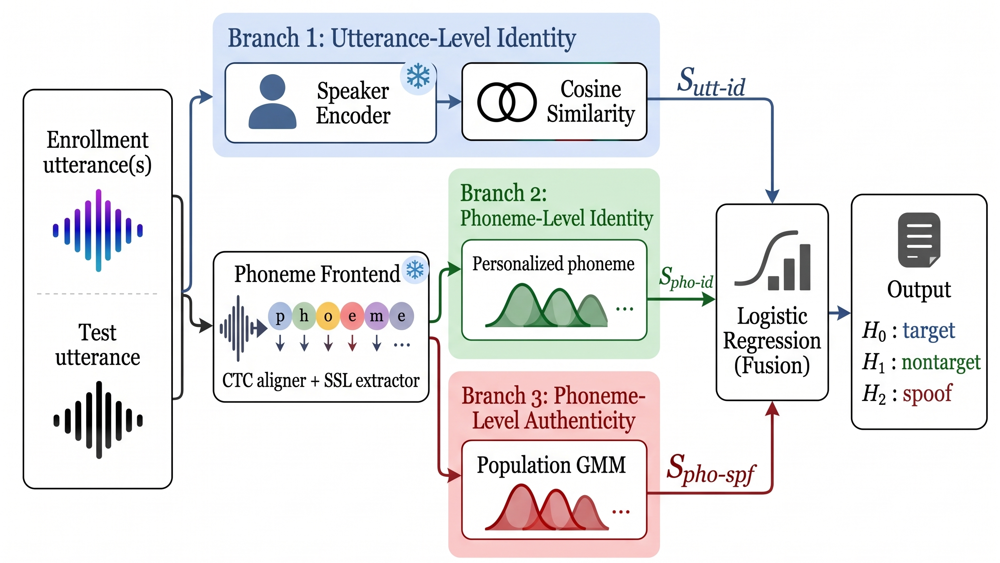

<h1 align="center">🛡️ PRISM-SASV</h1>
<p align="center"><b>P</b>honeme-<b>R</b>esolved <b>I</b>dentity and <b>S</b>poof <b>M</b>odeling for <b>S</b>poofing-<b>A</b>ware <b>S</b>peaker <b>V</b>erification</p>

<p align="center">
  
  
  
</p>

A lightweight, statistical, phoneme-conditioned Spoofing-Aware Speaker Verification (SASV)
system. A frozen CTC phoneme aligner segments each utterance into phonemes; a frozen SSL frontend
provides frame features; three branches then score the trial, fused by a 3-way
(target / nontarget / spoof) multinomial logistic regression.

<p align="center">
  
</p>

## 🧩 Method

| | Branch | What it scores | How |
|---|---|---|---|
| 🗣️ | **1 -- Utterance-level identity** | `S_utt-id` | ECAPA-TDNN cosine similarity to the enrollment centroid |
| 🧬 | **2 -- Personalized phoneme-level identity** | `S_pho-id` | Per-speaker, per-phoneme GMMs; z-normalized log-likelihood under the claimed speaker's own phoneme GMMs, restricted to the top-K phonemes that best separate this speaker from the population |
| 🛡️ | **3 -- Population-level phoneme-level authenticity** | `S_pho-spf` | Shared bona-fide/spoof phoneme GMMs (a phoneme-conditioned UBM); log-likelihood ratio, restricted to the top-K phonemes that best separate bona-fide from spoof at the population level |

No branch is trained end-to-end -- all three are closed-form statistical models fit from a
disjoint training corpus (ASVspoof2019 LA train) plus the target speaker's own enrollment audio.
The three scores are fused by a frozen multinomial logistic regression over `H0`/`H1`/`H2`
(target / nontarget / spoof); the final SASV score is `P(H0 | S_utt-id, S_pho-id, S_pho-spf)`.

## 📁 Repository layout

```
prism_sasv/          Core methodology: phoneme-conditioned GMMs, utility-based top-K selection,
                      Branch 2/3 scoring, 3-way fusion, metrics (EER, a-DCF), VAD truncation.
baselines/            SKA-TDNN, MFA-Conformer (SASV2_Baseline Stage 3), ECAPA-TDNN (Branch 1),
                      MMS-linear+ECAPA score-fusion baseline.
datasets/             Enrollment/trial construction for ASVspoof2021, ASVspoof5, FamousFigures,
                      SpoofCeleb, behind one common interface.
scripts/
  train_fusion.py     One-time setup: builds population UBMs + fits the frozen fusion classifier
                      (and the linear_cm baseline classifier) from ASVspoof2019 LA train.
  eval_full.py        Full-utterance evaluation across all systems x datasets.
  eval_duration.py     Short-utterance (1/2/3/4s, VAD-truncated) robustness evaluation.
  ablation.py         Branch-removal, no-top-K, and uniform-weighting ablations.
configs.py            All machine-specific paths and hyperparameters -- fill in before running.
```

## ⚙️ Setup

```bash
pip install -r requirements.txt
```

Then point the paths in `configs.py` at the components below.

### Models

| Component | Source |
|---|---|
| Phoneme aligner (CTC) | [`facebook/wav2vec2-xlsr-53-espeak-cv-ft`](https://huggingface.co/facebook/wav2vec2-xlsr-53-espeak-cv-ft) |
| SSL frontend | [`nii-yamagishilab/mms-300m-anti-deepfake`](https://huggingface.co/nii-yamagishilab/mms-300m-anti-deepfake) ([Wang et al., 2025](https://arxiv.org/abs/2506.21090)), an anti-spoofing post-trained variant of Meta's [MMS-300M](https://huggingface.co/facebook/mms-300m) |
| Branch 1 speaker encoder | ECAPA-TDNN ([Desplanques et al., 2020](https://arxiv.org/abs/2005.07143)) -- not vendored; point `configs.ECAPA_MODEL_PATH`/`ECAPA_CHECKPOINT_PATH` at any implementation producing a fixed-size embedding from a 16kHz waveform (e.g. SpeechBrain's [`spkrec-ecapa-voxceleb`](https://huggingface.co/speechbrain/spkrec-ecapa-voxceleb)) |
| SKA-TDNN / MFA-Conformer baselines | [`sasv-challenge/SASV2_Baseline`](https://github.com/sasv-challenge/SASV2_Baseline) ([Shim et al., 2022](https://arxiv.org/abs/2203.14672)), Stage-3 checkpoints (jointly fine-tuned on ASVspoof2019 LA train+dev). Not published by the repo authors -- obtain them directly. MFA-Conformer's bundled wenet Conformer requires `typeguard==2.13.3` (pinned in `requirements.txt`) |

### Datasets

| Dataset | Source |
|---|---|
| ASVspoof2019 LA | [datashare.ed.ac.uk/handle/10283/3336](https://datashare.ed.ac.uk/handle/10283/3336) ([Yamagishi et al., 2019](https://www.asvspoof.org/)) |
| ASVspoof2021 LA | [zenodo.org/record/4837263](https://zenodo.org/record/4837263) ([Yamagishi et al., 2021](https://arxiv.org/abs/2109.00537)) |
| ASVspoof5 | [`jungjee/asvspoof5`](https://huggingface.co/datasets/jungjee/asvspoof5) on HuggingFace, or [github.com/asvspoof-challenge/asvspoof5](https://github.com/asvspoof-challenge/asvspoof5) ([Wang et al., 2024](https://arxiv.org/abs/2408.08739)), Track 2 evaluation release |
| SpoofCeleb | [`jungjee/spoofceleb`](https://huggingface.co/datasets/jungjee/spoofceleb) on HuggingFace, or [jungjee.github.io/spoofceleb](https://jungjee.github.io/spoofceleb/) ([Jung et al., 2024](https://arxiv.org/abs/2409.17285)) |
| FamousFigures | [`issf/famousfigures`](https://huggingface.co/datasets/issf/famousfigures) on HuggingFace -- **gated**; request access on the dataset page, then set `HF_TOKEN` in your environment before first use |

Point the relevant `configs.py` constants at each (protocol files, audio roots, parquet dirs).

## ▶️ Usage

```bash
# 1. One-time: build population models + frozen fusion classifier (+ linear_cm baseline)
python scripts/train_fusion.py

# 2. Full-utterance evaluation
python scripts/eval_full.py --system all --dataset all

# 3. Short-utterance (duration robustness) evaluation
python scripts/eval_duration.py --system all --dataset all --durations 1,2,3,4

# 4. Ablation study
python scripts/ablation.py --ablation all --dataset all
```

Each script accepts `--system`/`--ablation`/`--dataset all` (default) or a specific value, and
appends its results to a CSV under `results/`.

## 📏 Metrics

- **a-DCF** (architecture-agnostic detection cost function, [Shim et al., 2024](https://arxiv.org/abs/2403.01355)), computed with the official ASVspoof5 Track 2 priors
  (`p_tar=0.9405, p_non=0.0095, p_spoof=0.05`, cost weights `c_miss=1, c_fa_asv=10, c_fa_cm=10`)
  -- see `prism_sasv/metrics.py`.
- **SASV-EER**, computed over target vs. nontarget+spoof trials pooled as the negative class.
